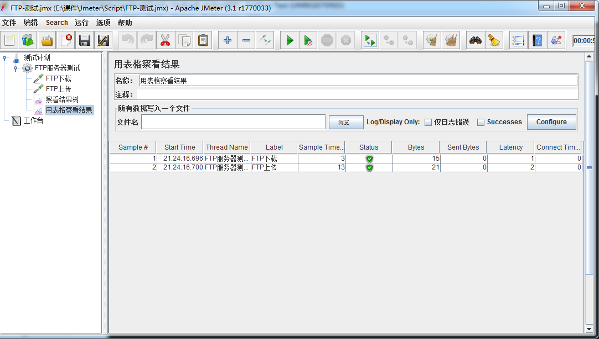
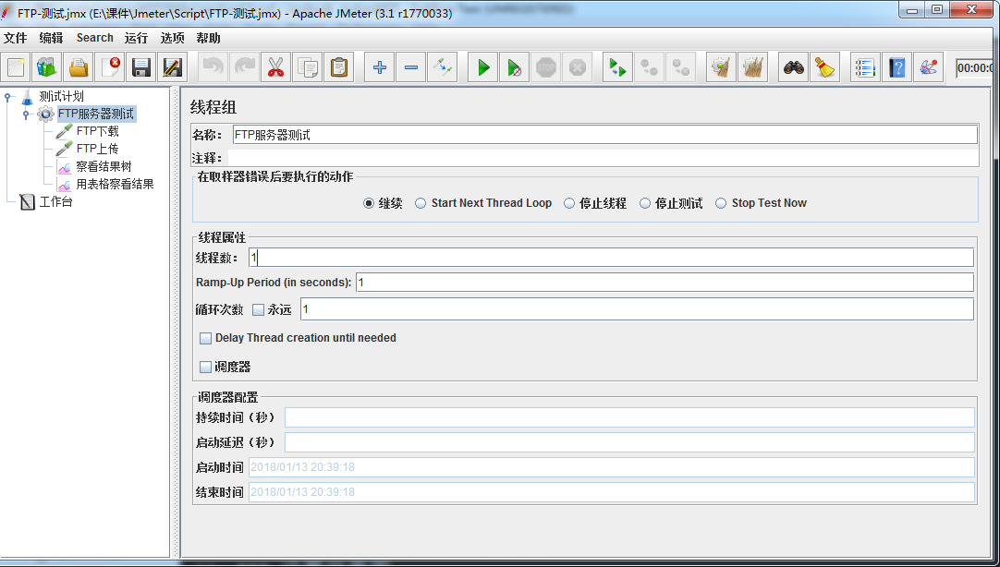
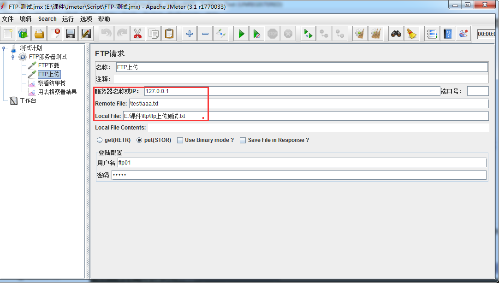
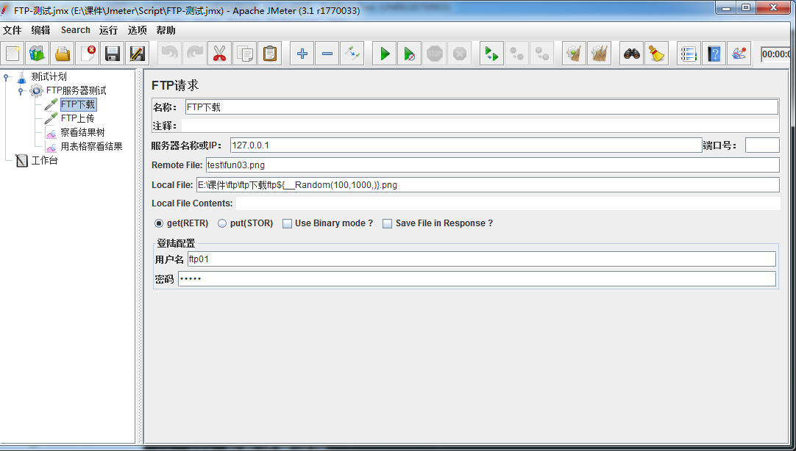
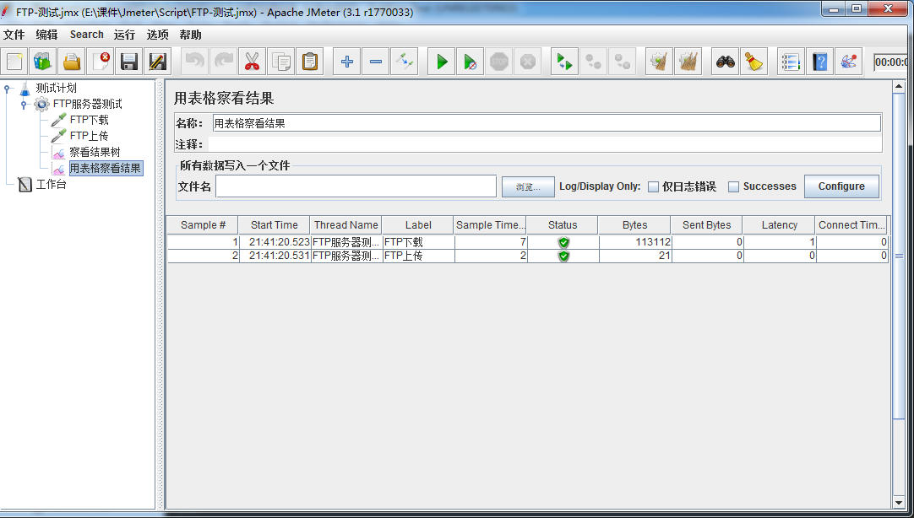

# 
Jmeter FTP测试
   
---
## 目标
- 了解Jmeter对FTP服务器测试

---  
## A. 场景
 #### 对FTP服务器进行压测（上传和下载）

### A.1 效果图  

### A.2 操作流程
> - 线程组
- FTP请求(上传)
- FTP请求(下载)
- 察看结果树/用表格察看结果

---

### A.3 线程组：   
可根据实际情况修改线程等参数  
### 线程效果图：
   

### A.4 FTP请求(上传):   
线程组--->添加--->sampler--->FTP请求  

### FTP请求(上传)图
  
### 参数设置详情：  
> - **Remote file：**上传到FTP服务器新的文件名+后缀
- **local file：**为本地存放到本机上的路径+文件名+后缀
- get(RETR)：为下载文件
- **put(RETR)：**为上传文件
- Use Binary mode?：使用二进制模式  
- Save File in Response?：保存响应文件  
- 用户名：ftp服务器用户名
- 密码：ftp服务器的密码
     

### A.5 FTP请求(下载):   
线程组--->添加--->sampler--->FTP请求  

### FTP请求(下载)图
  
### 参数设置详情：  
> - **Remote file：**FTP服务器要下载的文件路径+文件名+后缀
- **local file：**为存放到本机上的路径+文件名+后缀
- **get(RETR)：**为下载文件
- put(RETR)：为上传文件
- Use Binary mode?：使用二进制模式  
- Save File in Response?：保存响应文件  
- 用户名：ftp服务器用户名
- 密码：ftp服务器的密码
   

### A.6 用表格察看结果     
线程组--->添加--->监控器--->用表格察看结果

---   

### 提示：  
**根据实际情况可使用-FTP请求缺省值**  
(线程组--->添加--->配置元件--->FTP请求缺省值)
