# 抓包工具
<!--sec data-title="抓包工具介绍" data-id="section01" data-show=true data-collapse=false ces-->

#### HTTP 协议抓包工具**
* FileFox
* Chrome
* IE
* Fiddler（仅 windows 系统）
* Charles
* ...

#### TCP 协议抓包工具
* Wireshark
* tcpdump
* ...

<!--endsec-->

<!--sec data-title="抓包工具的作用" data-id="section02" data-show=true data-collapse=false ces-->

> 分析爬取对象，为我们未来编写爬虫自定策略。

<!--endsec-->

<!--sec data-title="抓包工具原理" data-id="section03" data-show=true data-collapse=false ces-->

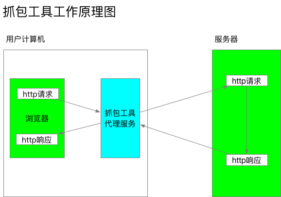

<!--endsec-->


<!--sec data-title="Charles 工具" data-id="section04" data-show=true data-collapse=false ces-->

### Mac 系统平台

#### 安装
* 拷贝 `Charles.app` 到 `/Applications` 目录下
* 替换 `charles.jar` 到 `/Applications/Charles.app/Contents/Java` 目录下

#### 启动系统代理
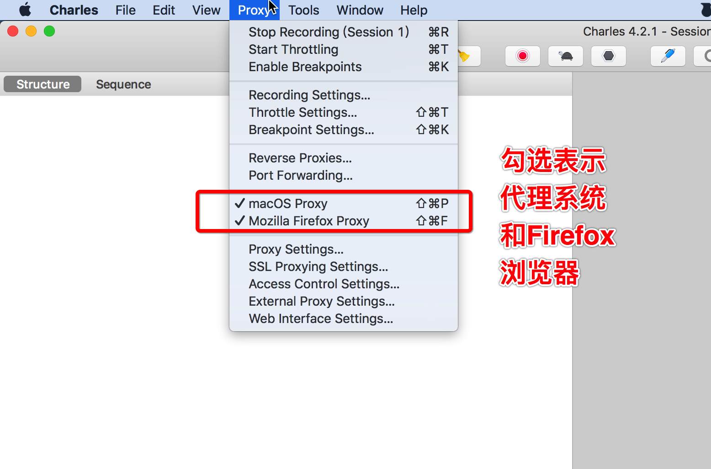

#### 基本使用
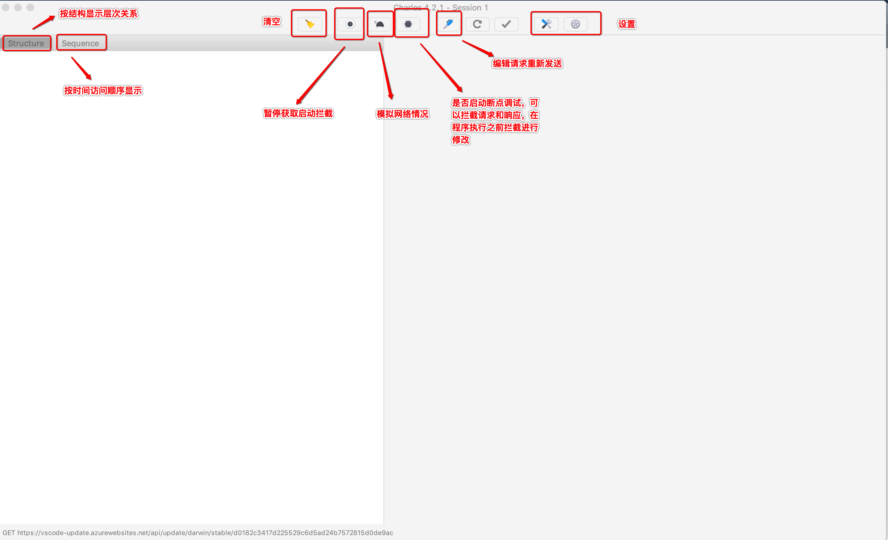

#### 配置过滤
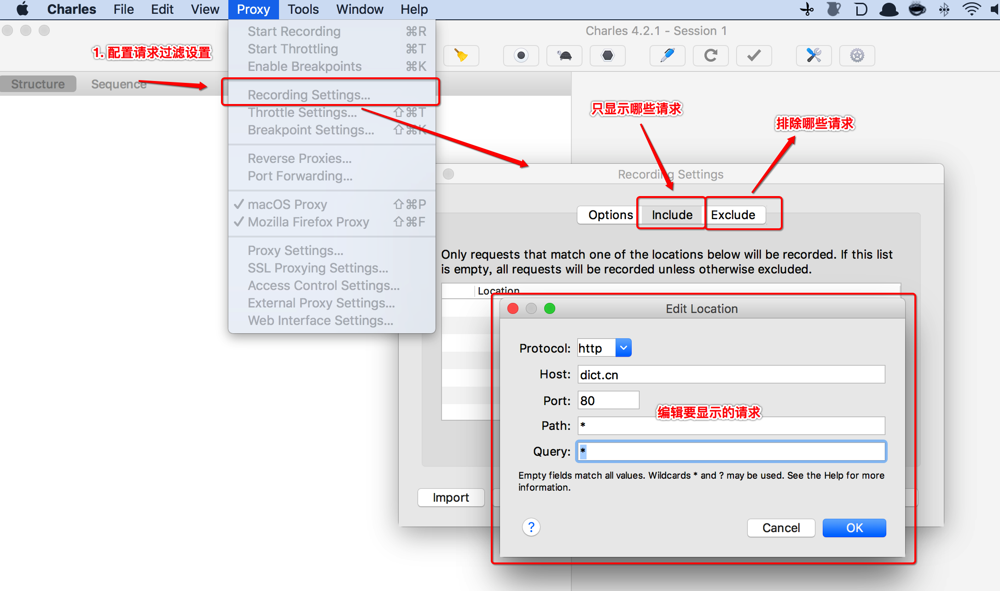

#### 其他功能
* 断点设置
* 本地映射
* 远程映射
* 等

#### https 拦截配置
##### 原理


##### 配置流程
1. 安装系统证书（未来用于配置）
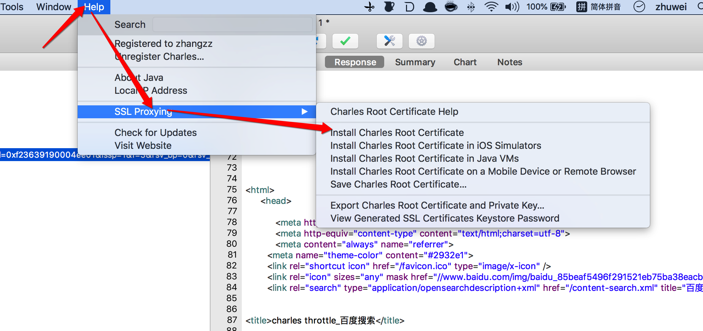

2. 开启拦截https
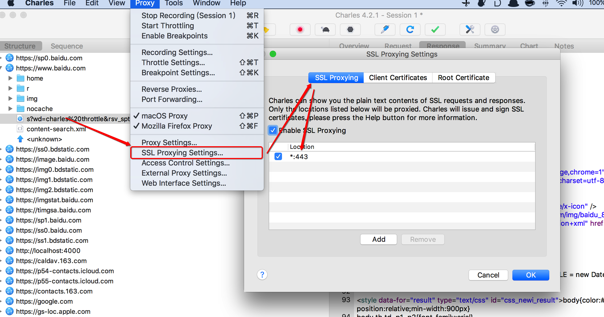

#### 远程代理服务器开启
1. 开启远程代理
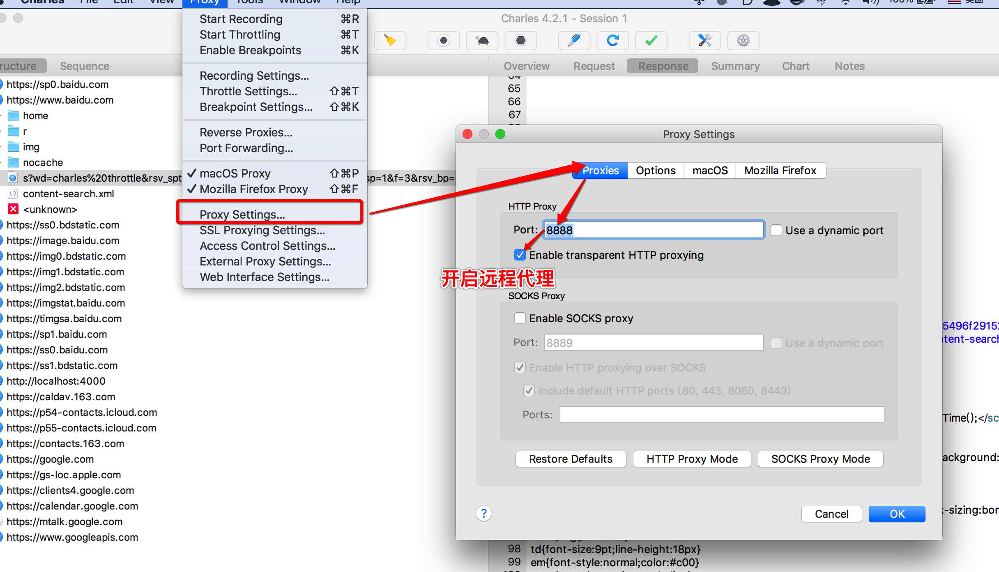

#### 移动端配置
##### 基本 http 拦截
1. 保证手机端和电脑端保持在同一个网络中
2. 在手机端配置代理服务器

##### https 拦截
1. 访问代理服务器获取安装证书
2. 如果是iOS端确认证书

### Linux 系统平台

#### 安装
```
    #  解压 charles 到 opt 目录下
    sudo tar -zxvf ~/Desktop/charles-proxy-4.2.1_amd64.tar.gz -C /opt/
    # 修改目录权限
    sudo chmod -R 777 /opt/charles
    # 拷贝破解文件
    sudo cp ~/Desktop/charles.jar /opt/charles/lib/
    # 启动charles
    /opt/charles/bin/charles
    # 添加桌面快捷方式
    sudo cp ~/Desktop/Charles.desktop /usr/share/applications
```

#### 配置系统代理
##### Charles 启动远程代理服务器
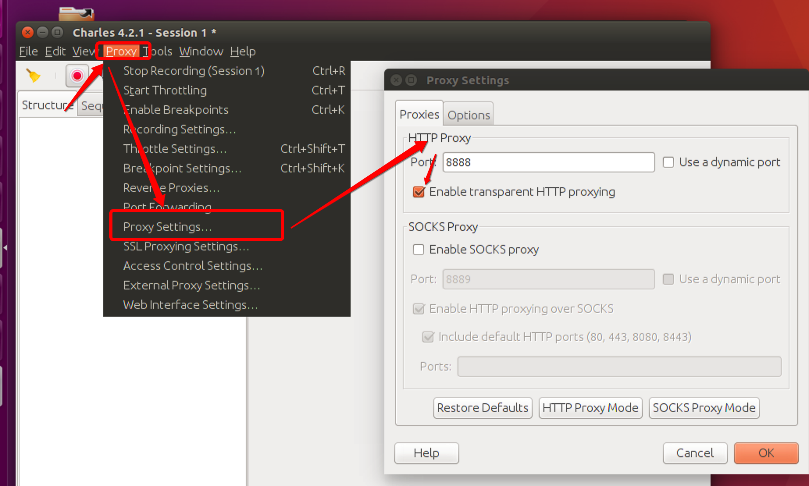

##### 配置系统代理
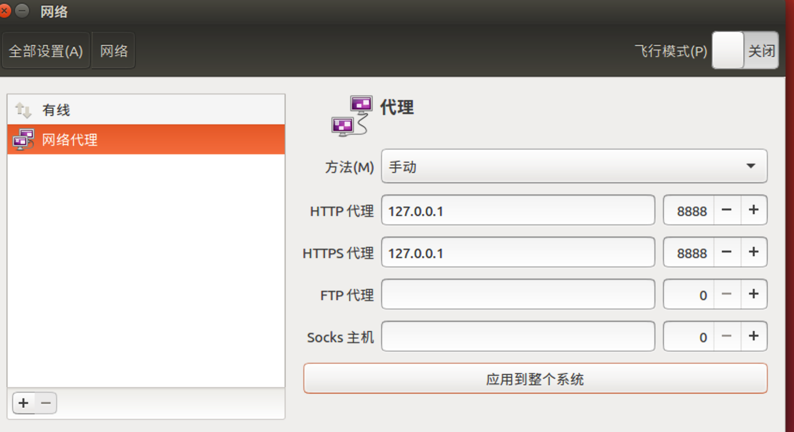

#### https 配置
##### 配置ssl抓取
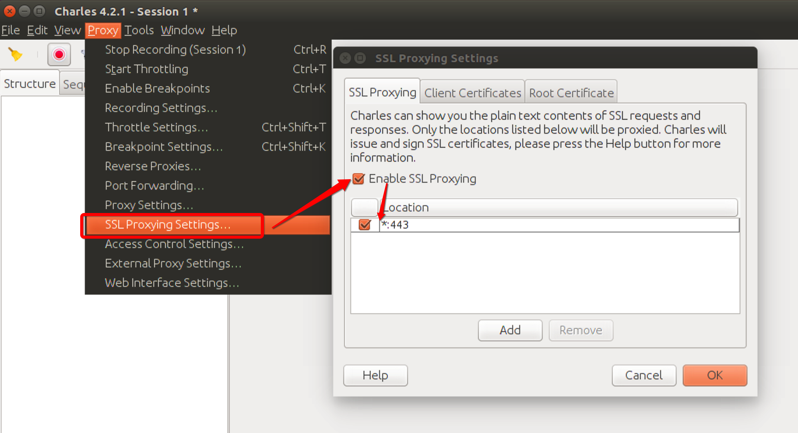
##### 到处根证书并且保存根证书在桌面
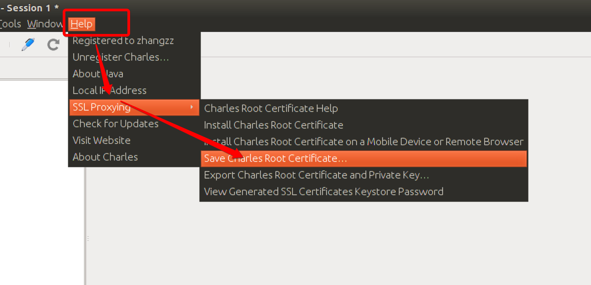
##### 根证书转换&安装根证书
```
# 转换根证书格式
openssl x509 -outform der -in ~/Desktop/charles.pem -out ~/Desktop/charles.crt

# 拷贝自定义根证书
sudo cp ~/Desktop/charles.crt /usr/local/share/ca-certificates/charles.crt

# 更新证书
sudo update-ca-certificates 
```

#### chrome 插件介绍

<!--endsec-->

<!--sec data-title="Fiddler 工具" data-id="section05" data-show=true data-collapse=false ces-->

# 提供视频

<!--endsec-->

